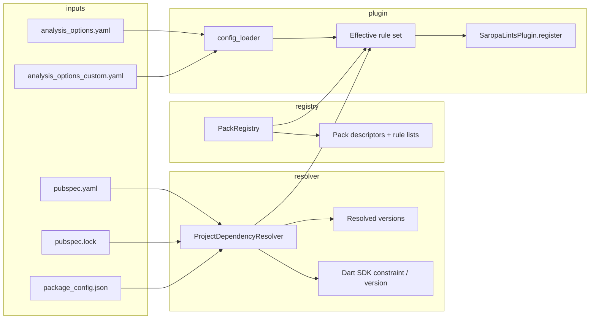

# Plan: Migration packs & plugin-style rule modules

**Status:** living architecture plan (expand as we implement).  
**Audience:** maintainers implementing packs, init UX, and dependency resolution.

---

## Table of contents

1. [Executive summary](#1-executive-summary)
2. [Problem statement](#2-problem-statement)
3. [Vision: what “done” looks like](#3-vision-what-done-looks-like)
4. [Concepts and terminology](#4-concepts-and-terminology)
5. [Architecture](#5-architecture)
6. [Integration with the current codebase](#6-integration-with-the-current-codebase)
7. [Policy decisions (must resolve)](#7-policy-decisions-must-resolve)
8. [Data model](#8-data-model)
9. [Configuration schema](#9-configuration-schema)
10. [Phases, deliverables, exit criteria](#10-phases-deliverables-exit-criteria)
11. [Migrating existing package rules (Drift, Riverpod, …)](#11-migrating-existing-package-rules-drift-riverpod-)
12. [Testing strategy](#12-testing-strategy)
13. [Documentation & discoverability](#13-documentation--discoverability)
14. [Risks, failure modes, mitigations](#14-risks-failure-modes-mitigations)
15. [Non-goals](#15-non-goals)
16. [Appendix A: package rule inventory](#appendix-a-package-rule-inventory)
17. [Appendix B: glossary](#appendix-b-glossary)

---

## 1. Executive summary

We want a **first-class way to group, enable, and auto-discover** lint rules that belong to:

- **Specific pub packages** (Drift, Riverpod, Hive, …),
- **Specific SDK / Flutter versions** (Dart language upgrades, Flutter breaking changes),
- **Optional semver migrations** (e.g. “you are on `collection` ≥ 1.19—prefer `flattenedToList`”).

Today those rules mostly live in **tiers** (`lib/tiers/*.yaml`, `lib/src/tiers.dart`) and are **on whenever the tier is on**, with only **partial** gating (`ProjectContext.hasDependency`, `FileType`, or raw AST patterns). There is **no resolved-version** story and no user-facing **“pack”** abstraction.

**This plan defines:**

- **Migration packs** (stable ids, metadata, predicates, member rule ids).
- A **resolution layer** (pubspec + lockfile + SDK) to answer “does this pack apply?” and “which semver migrations apply?”
- **Explicit integration** with `SaropaLintsPlugin` registration, `config_loader`, and `dart run saropa_lints:init`.
- A **migration path** for the ~400+ rules under `lib/src/rules/packages/` so they can be **assigned to packs** and optionally **auto-suggested** from dependencies.

---

## 2. Problem statement

| Issue | Impact |
|-------|--------|
| **Tiers are coarse** | Enabling `recommended` turns on hundreds of rules; users cannot say “only Drift-related” without hand-toggling dozens of `diagnostics:` keys. |
| **No resolved versions** | `ProjectContext.hasDependency` reads **names** from `pubspec.yaml` only. Semver-gated migrations (package X ≥ 2.0) are **impossible** without `pubspec.lock` / `package_config`. |
| **Inconsistent gating** | Some rules check `hasDependency('bloc')`; most Drift/Hive/Isar rules use **patterns only**—good for detection, bad for **“you don’t use this stack”** UX and auto-enable. |
| **`FileType.provider` mixes stacks** | Riverpod and Provider share one bucket—pubspec-based packs can disambiguate. |
| **No product surface** | There is no **menu of packs** tied to **this repo’s** dependencies; discovery is tribal knowledge (ROADMAP, tiers). |

---

## 3. Vision: what “done” looks like

1. **Developer** runs `dart run saropa_lints:init` (or a future subcommand) and sees: *“These migration packs match your project: Drift, Riverpod, …”* with short descriptions.
2. **Developer** enables `pack_drift` (name TBD) and gets **Drift-related rules** without enabling unrelated package rules—either by **expanding diagnostics** for those rule ids or by **pack-level enable** that maps to many rules.
3. **CI** can pin: `migration_packs: enabled: [drift_2_x]` and rely on **lockfile** so suggestions only apply when versions match.
4. **Maintainers** add a new semver migration by: new rule class → register in `all_rules.dart` → add rule id to **pack registry** + optional version predicate—no second analyzer plugin required for v1.

---

## 4. Concepts and terminology

| Term | Meaning |
|------|---------|
| **Pack** | Named bundle: `pack_id`, metadata, **predicate** (deps / SDK / Flutter), **set of rule codes**. Lives inside saropa_lints v1 (not necessarily a separate pub package). |
| **Predicate** | Boolean logic: e.g. `direct_dep('drift')`, `resolved_version('collection', '>=1.19.0')`, `sdk('>=3.4.0')`, `is_flutter_project`. |
| **Library pack** | Rules for correct/safe use of a library (most of today’s `drift_rules`, etc.). |
| **Semver migration** | Optional sub-profile inside a pack: rules that only apply when **resolved** version is in range. |
| **SDK / framework pack** | Rules tied to Dart SDK or Flutter version (may overlap with existing `migration_rules.dart`). |

---

## 5. Architecture

### 5.1 High-level flow



### 5.2 Components (responsibilities)

| Component | Responsibility |
|-----------|------------------|
| **ProjectDependencyResolver** | Per project root: parse lockfile (and/or package_config) for **resolved** package versions; expose `versionOf('drift')`, `hasDirectDep('riverpod')`, etc. Cache invalidation when lockfile mtime changes. |
| **PackRegistry** | Static table: `pack_id` → title, description, tags, **rule codes**, **predicate** (and optional semver sub-entries). |
| **PackEvaluator** | Given resolver + optional user config, compute: **applicable packs**, **enabled packs** (user opted in), **effective extra rules** from packs. |
| **Plugin merge logic** | Combine **tier-selected rules** with **pack-selected rules** per [§7](#7-policy-decisions-must-resolve). Feed `getRulesFromRegistry` / registration. |
| **init / CLI** | List applicable packs; optionally append YAML snippets to `analysis_options.yaml` or document `migration_packs.enabled`. |

### 5.3 Where evaluation runs

- **Registration time** (`lib/main.dart` `register`): decide **which rule instances to register** (if we skip registering pack-disabled rules for perf).
- **Analysis time** (per rule `runWithReporter`): optional **guard** for semver-only rules if registration stays coarse.

**Recommendation:** register **tier rules as today**; for **pack-only** rules (if any), register only when pack enabled. For **library packs** that duplicate tier membership, prefer **registration filter** or **guard** based on [§7.1](#71-tier--pack-boolean-algebra).

### 5.4 Known limitation: project root vs `Directory.current`

`loadNativePluginConfig` uses `Directory.current` for `analysis_options.yaml` unless later refreshed from project root (`loadOutputConfigFromProjectRoot`). Pack resolution **must** use the **same project root** as the analyzed file (`ProjectContext.findProjectRoot`) when computing deps—not only CWD. This is called out in implementation tasks.

---

## 6. Integration with the current codebase

| Area | File(s) | Role |
|------|---------|------|
| Plugin entry | `lib/main.dart` | `SaropaLintsPlugin.register` — inject merged enabled rule set. |
| Config | `lib/src/native/config_loader.dart` | Extend to read `migration_packs` (or equivalent) from `analysis_options.yaml` / custom yaml. |
| Rule enablement | `SaropaLintRule.enabledRules`, `disabledRules` | Today: tier + `diagnostics:` + severities. Must merge with **pack enables** without breaking existing users. |
| Project context | `lib/src/project_context_project_file.dart` | `hasDependency`, `findProjectRoot` — extend or add sibling for **versions**. |
| File classification | `FileTypeDetector` | Remains for perf; **packs** add pubspec-based gating for stacks that share `FileType.provider`. |
| Tiers | `lib/src/tiers.dart`, `lib/tiers/*.yaml` | Long-term: package rules may move from “tier by default” to “tier + pack” per policy. |
| Init | `bin/` / `tool/` (init command) | Surface pack list and generated config. |
| Docs | `ROADMAP.md`, `CHANGELOG.md` | Pack ids and user-facing names. |

---

## 7. Policy decisions (must resolve)

Decisions below block implementation detail; pick defaults before coding.

### 7.1 Tier × pack boolean algebra

| Option | Behavior | Pros | Cons |
|--------|----------|------|------|
| **A — Pack adds rules** | Effective = tier ∪ pack rules (pack can enable rules **not** in tier) | Flexible; “Drift-only” without enabling full tier | Possible confusion if tier omitted |
| **B — Pack filters tier** | Effective = tier ∩ pack for package families | Clear “subset of what I already enabled” | Packs empty if user uses minimal tier |
| **C — Packs replace tiers for package rules** | Package rules **removed** from tiers; only via packs | Clean product story | **Breaking** unless major version |

**Recommendation for v1:** **A** for *new* opt-in pack-only rules (semver migrations); **B** optional as “strict pack mode”; avoid **C** until a major release with migration guide.

### 7.2 Auto-detect: suggest vs enable

| Mode | Behavior |
|------|----------|
| **Suggest (default)** | init/IDE lists matching packs; user confirms. |
| **Auto-enable** | Opt-in flag: e.g. `migration_packs.auto_enable_matching: true`. |

### 7.3 Direct vs transitive dependencies

| Option | Use when |
|--------|----------|
| **Direct only** | User-facing packs match “what I put in pubspec.” |
| **Transitive** | Rare; e.g. suggest migration for `collection` pulled in by another package—noisier. |

**Default:** **direct** for auto-suggest; allow override for power users later.

### 7.4 Composite rules (e.g. Isar + Drift)

- **Option 1:** Rule belongs to **both** packs; enabled if **either** pack enabled and predicate matches.
- **Option 2:** Dedicated `pack_database_migration` composite id.

**Default:** **Option 1** with explicit multi-membership in registry.

---

## 8. Data model

### 8.1 Pack descriptor (conceptual)

```yaml
pack_id: drift
title: "Drift (SQLite)"
description: "Safety and correctness for drift databases."
tags: [database, drift]
predicate:
  any_direct_dep: [drift, drift_dev]   # naming TBD
rule_codes:
  - avoid_drift_raw_sql_interpolation
  - require_drift_database_close
  # ...
semver_migrations:  # optional subsection
  - min_version: "2.0.0"
    rule_codes:
      - prefer_some_new_api
```

### 8.2 Rule → pack index

Reverse map: `rule_code` → `List<pack_id>` for init UX (“this rule is part of Drift pack”) and composite rules.

---

## 9. Configuration schema

**Sketch** (exact keys to align with `config_loader` parsing):

```yaml
plugins:
  saropa_lints:
    version: "9.x.x"
    migration_packs:
      enabled:
        - drift
        - collection_1_19
      auto_suggest: true        # init lists matches
      auto_enable_matching: false
```

Alternatives: `migration_packs.drift: true` flattening—avoid if hundreds of packs exist.

**Parsing:** extend `_loadDiagnosticsConfig` pattern: new section reader, merge into static `SaropaMigrationPacksConfig` (new type) consumed by merge logic.

**Backward compatibility:** If `migration_packs` absent, behavior = **today** (tiers only).

---

## 10. Phases, deliverables, exit criteria

### Phase 0 — Decisions & design

**Deliverables:** ADR or locked answers for §7; finalized config schema; pack naming convention (`snake_case` ids).

**Exit:** Maintainer sign-off; no code required.

### Phase 1 — Resolver foundation

**Deliverables:**

- Parse `pubspec.lock` (YAML) at `ProjectContext.findProjectRoot(path)` for **resolved** versions of **direct** dependencies.
- Unit tests: fixture lockfiles → expected versions.
- Document failure: missing lockfile → “run `dart pub get`” / skip semver migrations.

**Exit:** `resolvedVersion('collection')` works in tests; cached per project root.

### Phase 2 — Registry + merge (no UX)

**Deliverables:**

- `PackRegistry` with **one** pilot pack (e.g. `collection_1_19` or `drift` minimal subset).
- Merge logic in registration path: **enabled pack rules** ∪ tier rules per §7.1.
- Tests: enable pack only → expected rule codes registered.

**Exit:** Analysis runs with pack config in `analysis_options.yaml` in a fixture project.

### Phase 3 — init / menu

**Deliverables:**

- `init` lists **applicable** packs from resolver + registry.
- Optional: `--enable-pack drift` writes YAML.

**Exit:** Documented user flow in README or ROADMAP.

### Phase 4 — Bulk assign pack ids

**Deliverables:**

- Script or codegen: rule codes from `packages/*` → pack ids (see §11).
- Gradual rollout: Drift, Riverpod, Hive, …

**Exit:** Coverage % of package rules assigned; remaining tracked as issues.

### Phase 5 — SDK / Flutter packs

**Deliverables:**

- Predicate sources: `environment.sdk`, Flutter version (where reliable).
- Map existing SDK migration rules from `migration_rules.dart` into packs.

**Exit:** At least one `dart_sdk_*` pack end-to-end.

### Phase 6 — Optional: external API / second plugin

Only if org customers need private packs without forking saropa_lints.

---

## 11. Migrating existing package rules (Drift, Riverpod, …)

### 11.1 Current state (short)

- ~24 files under `lib/src/rules/packages/`, **~400+** rule classes (see Appendix A).
- Gating: sparse `hasDependency`, `FileType`, or **pattern-only**.
- All still tier-driven.

### 11.2 Migration steps (per family)

1. Define **`pack_id`** (e.g. `drift`, `riverpod`).
2. List **rule codes** → pack membership in registry.
3. Add **predicate** (`direct_dep` includes `drift` / `flutter_riverpod` / …).
4. Decide **tier interaction** (§7.1): keep rules in tiers **and** allow pack-only toggles, or document overlap.
5. Add **init** text and ROADMAP row.
6. **Tests:** pack fixture in `test/` + optional `example_packages` unchanged or tagged.

### 11.3 Special cases

- **`package_specific_rules.dart`:** split into multiple pack ids or tag subgroups.
- **Composite rules** (`avoid_isar_import_with_drift`): dual membership (§7.4).
- **Riverpod vs Provider:** predicate uses correct pub names.

---

## 12. Testing strategy

| Layer | What to test |
|-------|----------------|
| **Unit** | Lockfile parsing edge cases (path deps, SDK constraint, missing file). |
| **Unit** | Predicate evaluation: version ranges, direct deps. |
| **Integration** | Minimal project with `analysis_options.yaml` enabling one pack → only expected diagnostics / registered rules. |
| **Regression** | No `migration_packs` section → identical behavior to pre-feature for same tier. |
| **init** | Golden output or substring match for “applicable packs” list. |

---

## 13. Documentation & discoverability

- **ROADMAP.md:** table column or section “Pack” for pack-gated rules.
- **User doc:** explain difference between **tier**, **pack**, and **diagnostic** override.
- **CHANGELOG:** breaking changes only if §7.1 option C or config renames.

---

## 14. Risks, failure modes, mitigations

| Risk | Mitigation |
|------|------------|
| Stale lockfile | Message when lockfile missing or older than pubspec; semver rules no-op. |
| Wrong project root | Always resolve from analyzed file; document multi-package repos. |
| Config merge bugs | Explicit tests for `enabledRules` / `disabledRules` / severity interactions. |
| Explosion of pack ids | Naming convention; optional nested `semver_migrations` under one library pack. |
| Performance | Cache resolver per root; avoid parsing lockfile per file. |

---

## 15. Non-goals

- Replacing `dart analyze` deprecation reporting entirely.
- Hosting pack definitions on a remote server (offline-first).
- Supporting every transitive package on pub by default.

---

## Appendix A: package rule inventory

| File (`lib/src/rules/packages/`) | Approx. rule classes | Primary domain |
|-----------------------------------|----------------------|----------------|
| `riverpod_rules.dart` | ~40 | Riverpod |
| `bloc_rules.dart` | ~54 | Bloc/Cubit |
| `drift_rules.dart` | ~31 | Drift |
| `firebase_rules.dart` | ~34 | Firebase |
| `hive_rules.dart` | ~26 | Hive |
| `getx_rules.dart` | ~24 | GetX |
| `isar_rules.dart` | ~23 | Isar |
| `provider_rules.dart` | ~28 | Provider |
| `package_specific_rules.dart` | ~19 | Mixed |
| `dio_rules.dart` | ~14 | Dio |
| `equatable_rules.dart` | ~14 | Equatable |
| `shared_preferences_rules.dart` | ~12 | shared_preferences |
| `auto_route_rules.dart` | ~7 | auto_route |
| `flutter_hooks_rules.dart` | ~5 | flutter_hooks |
| `get_it_rules.dart` | ~5 | get_it |
| `geolocator_rules.dart` | ~4 | geolocator |
| `sqflite_rules.dart` | ~3 | sqflite |
| `url_launcher_rules.dart` | ~3 | url_launcher |
| `workmanager_rules.dart` | ~3 | workmanager |
| `qr_scanner_rules.dart` | ~3 | QR / scanner |
| `supabase_rules.dart` | ~3 | Supabase |
| `graphql_rules.dart` | ~1 | graphql |
| `rxdart_rules.dart` | ~2 | rxdart |
| `flame_rules.dart` | ~2 | Flame |

**Fixtures:** `example_packages/lib/<domain>/` aligns with future pack ids.

---

## Appendix B: glossary

| Term | Definition |
|------|------------|
| **Tier** | essential / recommended / … YAML sets of enabled rule codes. |
| **Pack** | Named module of rules + predicates for discovery and enablement. |
| **Predicate** | Condition for showing or applying a pack (deps, versions, SDK). |
| **Semver migration** | Rule gated on **resolved** package version range. |

---

_Document status: expanded architecture plan — revise when Phase 0 decisions are locked._
