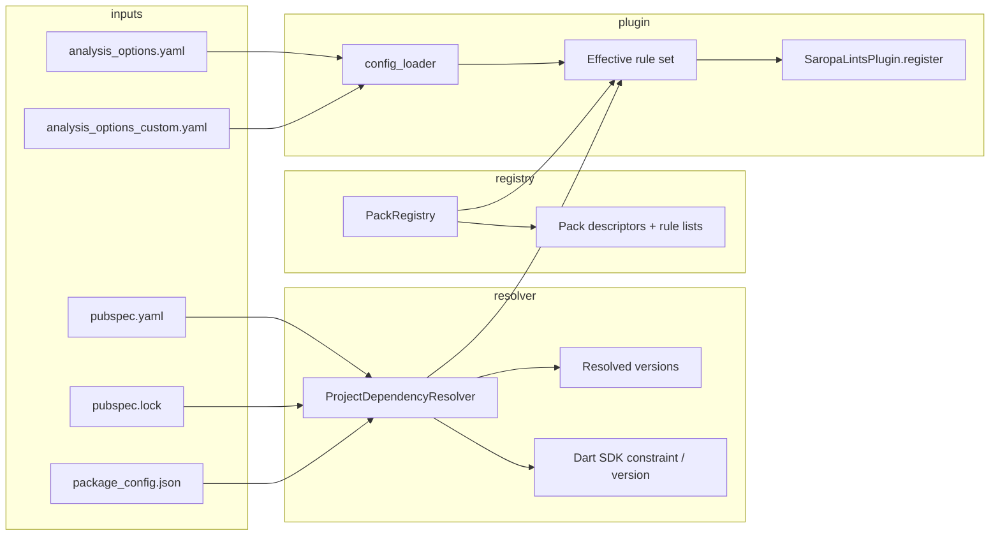

# Plan: Migration packs & plugin-style rule modules

**Status:** living architecture plan (expand as we implement).  
**Audience:** maintainers implementing packs, init UX, dependency resolution, and the VS Code extension.

**Single document:** Packs, pubspec-aware enablement, semver migrations, extension UI, and optional third-party plugins are **one product intent** delivered in **phases** (see [§10](#10-phases-one-roadmap)).

---

## Table of contents

0. [Phases at a glance](#0-phases-at-a-glance)
1. [Executive summary](#1-executive-summary)
2. [Problem statement](#2-problem-statement)
3. [Vision: what “done” looks like](#3-vision-what-done-looks-like)
4. [Concepts and terminology](#4-concepts-and-terminology)
5. [Architecture](#5-architecture)
6. [Integration with the current codebase](#6-integration-with-the-current-codebase)
7. [Policy decisions (must resolve)](#7-policy-decisions-must-resolve)
8. [Data model](#8-data-model)
9. [Configuration schema](#9-configuration-schema)
10. [Phases: one roadmap (detail)](#10-phases-one-roadmap-detail)
11. [Migrating existing package rules (Drift, Riverpod, …)](#11-migrating-existing-package-rules-drift-riverpod-)
12. [Testing strategy](#12-testing-strategy)
13. [Documentation & discoverability](#13-documentation--discoverability)
14. [Risks, failure modes, mitigations](#14-risks-failure-modes-mitigations)
15. [Non-goals](#15-non-goals)
16. [Appendix A: package rule inventory](#appendix-a-package-rule-inventory)
17. [Appendix B: glossary](#appendix-b-glossary)
18. [Appendix C: target platforms](#appendix-c-target-platforms)

---

## 0. Phases at a glance

| Phase | What ships |
|-------|------------|
| **0** | Lock policy (§7): tier×pack algebra, naming (`rule_packs`), defaults. |
| **1** | **Dart:** pack registry (`pack_id` → rule codes), `config_loader` reads `rule_packs.enabled`, merge into `register`, tests. **No extension yet.** |
| **2** | **VS Code extension:** pack rows (§10 Phase 2), **target platforms** summary (Appendix C), toggles → `analysis_options.yaml`, YAML merge tests. |
| **3** | **Resolver:** `pubspec.lock` / versions per project root for semver-gated pack entries. **Shipped:** `pubspec_lock_resolver`, `kRulePackDependencyGates`, `collection_compat` example; transitive-only semver UX deferred. |
| **4** | **CLI `init`:** list applicable packs; optional `--enable-pack`. **Shipped:** `--list-packs`, `--enable-pack` on `dart run saropa_lints:init`; YAML preservation in `generatePluginsYaml`. |
| **5** | **Bulk** assign rule codes → packs for all `lib/src/rules/packages/*` (script or codegen). |
| **6** | **SDK / Flutter** packs + map `migration_rules.dart` entries. |
| **7** | **Optional:** `saropa_lints_api` + second analyzer plugin for private org rules. |

Later sections (architecture, data model, §11 inventory) support **all** phases; implementation order is **0 → 1 → 2** for a vertical slice, then **3–6** as capacity allows.

---

## 1. Executive summary

We want a **first-class way to group, enable, and auto-discover** lint rules that belong to:

- **Specific pub packages** (Drift, Riverpod, Hive, …),
- **Specific SDK / Flutter versions** (Dart language upgrades, Flutter breaking changes),
- **Optional semver migrations** (e.g. “you are on `collection` ≥ 1.19—prefer `flattenedToList`”).

Today those rules mostly live in **tiers** (`lib/tiers/*.yaml`, `lib/src/tiers.dart`) and are **on whenever the tier is on**, with only **partial** gating (`ProjectContext.hasDependency`, `FileType`, or raw AST patterns). There is **no resolved-version** story and no user-facing **“pack”** abstraction.

**This plan defines:**

- **Migration packs** (stable ids, metadata, predicates, member rule ids).
- A **resolution layer** (pubspec + lockfile + SDK) to answer “does this pack apply?” and “which semver migrations apply?”
- **Explicit integration** with `SaropaLintsPlugin` registration, `config_loader`, and `dart run saropa_lints:init`.
- A **migration path** for the ~400+ rules under `lib/src/rules/packages/` so they can be **assigned to packs** and optionally **auto-suggested** from dependencies.

---

## 2. Problem statement

| Issue | Impact |
|-------|--------|
| **Tiers are coarse** | Enabling `recommended` turns on hundreds of rules; users cannot say “only Drift-related” without hand-toggling dozens of `diagnostics:` keys. |
| **No resolved versions** | `ProjectContext.hasDependency` reads **names** from `pubspec.yaml` only. Semver-gated migrations (package X ≥ 2.0) are **impossible** without `pubspec.lock` / `package_config`. |
| **Inconsistent gating** | Some rules check `hasDependency('bloc')`; most Drift/Hive/Isar rules use **patterns only**—good for detection, bad for **“you don’t use this stack”** UX and auto-enable. |
| **`FileType.provider` mixes stacks** | Riverpod and Provider share one bucket—pubspec-based packs can disambiguate. |
| **No product surface** | There is no **menu of packs** tied to **this repo’s** dependencies; discovery is tribal knowledge (ROADMAP, tiers). |

---

## 3. Vision: what “done” looks like

1. **Developer** runs `dart run saropa_lints:init` (or a future subcommand) and sees: *“These migration packs match your project: Drift, Riverpod, …”* with short descriptions.
2. **Developer** enables `pack_drift` (name TBD) and gets **Drift-related rules** without enabling unrelated package rules—either by **expanding diagnostics** for those rule ids or by **pack-level enable** that maps to many rules.
3. **CI** can pin: `rule_packs: enabled: [drift_2_x]` and rely on **lockfile** so suggestions only apply when versions match.
4. **Maintainers** add a new semver migration by: new rule class → register in `all_rules.dart` → add rule id to **pack registry** + optional version predicate—no second analyzer plugin required for v1.

---

## 4. Concepts and terminology

| Term | Meaning |
|------|---------|
| **Pack** | Named bundle: `pack_id`, metadata, **predicate** (deps / SDK / Flutter), **set of rule codes**. Implemented **inside** the `saropa_lints` package (registry + YAML). This is **not** a loadable third-party plugin API—packs only reference rule codes that exist in this repo. |
| **Predicate** | Boolean logic: e.g. `direct_dep('drift')`, `resolved_version('collection', '>=1.19.0')`, `sdk('>=3.4.0')`, `is_flutter_project`. |
| **Library pack** | Rules for correct/safe use of a library (most of today’s `drift_rules`, etc.). |
| **Semver migration** | Optional sub-profile inside a pack: rules that only apply when **resolved** version is in range. |
| **SDK / framework pack** | Rules tied to Dart SDK or Flutter version (may overlap with existing `migration_rules.dart`). |

---

## 5. Architecture

### 5.1 High-level flow



### 5.2 Components (responsibilities)

| Component | Responsibility |
|-----------|------------------|
| **ProjectDependencyResolver** | Per project root: parse lockfile (and/or package_config) for **resolved** package versions; expose `versionOf('drift')`, `hasDirectDep('riverpod')`, etc. Cache invalidation when lockfile mtime changes. |
| **PackRegistry** | Static table: `pack_id` → title, description, tags, **rule codes**, **predicate** (and optional semver sub-entries). |
| **PackEvaluator** | Given resolver + optional user config, compute: **applicable packs**, **enabled packs** (user opted in), **effective extra rules** from packs. |
| **Plugin merge logic** | Combine **tier-selected rules** with **pack-selected rules** per [§7](#7-policy-decisions-must-resolve). Feed `getRulesFromRegistry` / registration. |
| **init / CLI** | List applicable packs; optionally append YAML snippets to `analysis_options.yaml` or document `migration_packs.enabled`. |

### 5.3 Where evaluation runs

- **Registration time** (`lib/main.dart` `register`): decide **which rule instances to register** (if we skip registering pack-disabled rules for perf).
- **Analysis time** (per rule `runWithReporter`): optional **guard** for semver-only rules if registration stays coarse.

**Recommendation:** register **tier rules as today**; for **pack-only** rules (if any), register only when pack enabled. For **library packs** that duplicate tier membership, prefer **registration filter** or **guard** based on [§7.1](#71-tier--pack-boolean-algebra).

### 5.4 Known limitation: project root vs `Directory.current`

`loadNativePluginConfig` uses `Directory.current` for `analysis_options.yaml` unless later refreshed from project root (`loadOutputConfigFromProjectRoot`). Pack resolution **must** use the **same project root** as the analyzed file (`ProjectContext.findProjectRoot`) when computing deps—not only CWD. This is called out in implementation tasks.

---

## 6. Integration with the current codebase

| Area | File(s) | Role |
|------|---------|------|
| Plugin entry | `lib/main.dart` | `SaropaLintsPlugin.register` — inject merged enabled rule set. |
| Config | `lib/src/native/config_loader.dart` | Extend to read `rule_packs` from `analysis_options.yaml` / custom yaml. |
| Rule enablement | `SaropaLintRule.enabledRules`, `disabledRules` | Today: tier + `diagnostics:` + severities. Must merge with **pack enables** without breaking existing users. |
| Project context | `lib/src/project_context_project_file.dart` | `hasDependency`, `findProjectRoot` — extend or add sibling for **versions**. |
| File classification | `FileTypeDetector` | Remains for perf; **packs** add pubspec-based gating for stacks that share `FileType.provider`. |
| Tiers | `lib/src/tiers.dart`, `lib/tiers/*.yaml` | Long-term: package rules may move from “tier by default” to “tier + pack” per policy. |
| Init | `bin/` / `tool/` (init command) | Surface pack list and generated config. |
| Docs | `ROADMAP.md`, `CHANGELOG.md` | Pack ids and user-facing names. |

---

## 7. Policy decisions (must resolve)

Decisions below block implementation detail; pick defaults before coding.

### 7.1 Tier × pack boolean algebra

| Option | Behavior | Pros | Cons |
|--------|----------|------|------|
| **A — Pack adds rules** | Effective = tier ∪ pack rules (pack can enable rules **not** in tier) | Flexible; “Drift-only” without enabling full tier | Possible confusion if tier omitted |
| **B — Pack filters tier** | Effective = tier ∩ pack for package families | Clear “subset of what I already enabled” | Packs empty if user uses minimal tier |
| **C — Packs replace tiers for package rules** | Package rules **removed** from tiers; only via packs | Clean product story | **Breaking** unless major version |

**Recommendation for v1:** **A** for *new* opt-in pack-only rules (semver migrations); **B** optional as “strict pack mode”; avoid **C** until a major release with migration guide.

### 7.2 Auto-detect: suggest vs enable

| Mode | Behavior |
|------|----------|
| **Suggest (default)** | init/IDE lists matching packs; user confirms. |
| **Auto-enable** | Opt-in flag: e.g. `rule_packs.auto_enable_matching: true`. |

### 7.3 Direct vs transitive dependencies

| Option | Use when |
|--------|----------|
| **Direct only** | User-facing packs match “what I put in pubspec.” |
| **Transitive** | Rare; e.g. suggest migration for `collection` pulled in by another package—noisier. |

**Default:** **direct** for auto-suggest; allow override for power users later.

### 7.4 Composite rules (e.g. Isar + Drift)

- **Option 1:** Rule belongs to **both** packs; enabled if **either** pack enabled and predicate matches.
- **Option 2:** Dedicated `pack_database_migration` composite id.

**Default:** **Option 1** with explicit multi-membership in registry.

---

## 8. Data model

### 8.1 Pack descriptor (conceptual)

```yaml
pack_id: drift
title: "Drift (SQLite)"
description: "Safety and correctness for drift databases."
tags: [database, drift]
predicate:
  any_direct_dep: [drift, drift_dev]   # naming TBD
rule_codes:
  - avoid_drift_raw_sql_interpolation
  - require_drift_database_close
  # ...
semver_migrations:  # optional subsection
  - min_version: "2.0.0"
    rule_codes:
      - prefer_some_new_api
```

### 8.2 Rule → pack index

Reverse map: `rule_code` → `List<pack_id>` for init UX (“this rule is part of Drift pack”) and composite rules.

---

## 9. Configuration schema

**Sketch** (exact keys to align with `config_loader` parsing):

```yaml
plugins:
  saropa_lints:
    version: "9.x.x"
    rule_packs:
      enabled:
        - drift
        - riverpod
        - collection_1_19
      auto_suggest: true        # optional: init lists matches
      auto_enable_matching: false
```

Use **`rule_packs`** as the canonical key: it covers **library packs** (Drift, Riverpod) and **semver migration** entries (e.g. `collection_1_19`) in one mechanism. (If we ever printed `migration_packs`, treat it as an alias only during a transition.)

Alternatives: per-pack booleans — avoid if hundreds of packs exist.

**Parsing:** extend `config_loader` with a new section reader; merge into enabled rules after tier load (order: tier → add rules from enabled packs → apply `diagnostics: false` → severity overrides — document final order).

**Backward compatibility:** If `rule_packs` absent, behavior = **today** (tiers only).

---

## 10. Phases: one roadmap (detail)

Same intent as §0; this section is **deliverables + exit criteria** per phase.

### Phase 0 — Decisions & design

**Deliverables:** Locked answers for §7; canonical config key **`rule_packs`**; `snake_case` pack ids.

**Exit:** Maintainer sign-off; no code required.

### Phase 1 — Pack registry + linter (Dart only)

**Deliverables:**

- New registry (e.g. `lib/src/config/rule_packs.dart`): `Map<pack_id, Set<rule_code>>`; start with MVP packs (`riverpod`, `drift`, …) and a subset of rules each — grow in Phase 5.
- **`config_loader.dart`:** read `plugins.saropa_lints.rule_packs.enabled` from `analysis_options.yaml`.
- **`lib/main.dart` `register`:** merge tier-enabled rules with **all rules from enabled packs** per §7.1 (default: pack **adds** rules).
- **Tests:** fixture with `rule_packs.enabled: [riverpod]` proves a pack-only rule runs when listed in registry.

**Exit:** Hand-edited YAML enables packs without extension.

**Files:** `lib/src/config/rule_packs.dart` (new), `lib/src/native/config_loader.dart`, `lib/main.dart`, `test/…`

### Phase 2 — VS Code extension UI

**Screen requirements (each row = one pack, e.g. Riverpod, Drift):**

| Column / control | Behavior |
|------------------|----------|
| **Package / pack label** | Human-readable name (e.g. “Riverpod”) and optional primary pub names (`flutter_riverpod`, …). |
| **Detected in pubspec** | Clear state: **yes** if any mapped dependency appears in direct `dependencies` / `dev_dependencies`; **no** otherwise (pack still listed if we show all packs, with “not in project” — product choice: default **show all packs** with detected flag, or **only show packs that match** pubspec + always show SDK packs). |
| **Enabled** | Toggle bound to `rule_packs.enabled` for that `pack_id`. |
| **Rule count** | Number of rule codes in the pack registry for that `pack_id` (from shared metadata: ship JSON generated from Dart registry or duplicate small map in extension for Phase 2). |
| **Rules list** | **Link or command** that opens the **list of rule codes** (and ideally titles): e.g. webview, Quick Pick, or dedicated tree; deep link to **ROADMAP** / docs on pub.dev if each rule has a stable anchor. |
| **Platforms** | Summary of **which target platforms** this Flutter project includes (see [Appendix C](#appendix-c-target-platforms)): e.g. a small table or chip row **android / ios / web / windows / macos / linux** with **present vs absent** derived from `android/`, `ios/`, `web/`, `windows/`, `macos/`, `linux/` under the app package (or equivalent detection). Pure Dart packages may show **“Dart only”** or hide the block. Used for context when enabling platform-specific rule packs later; v1 can be **read-only display**. |

**Other deliverables:**

- Config (or new) sidebar view or webview implementing the table above (reuse `readPubspec`, `package-families.ts`).
- Toggles write **`rule_packs.enabled`** under `plugins.saropa_lints` without destroying `diagnostics:` / comments (dedicated merge helper, e.g. `rulePackWriter.ts`).
- Optional command `saropaLints.toggleRulePack` / `saropaLints.showPackRules`; respect `runAnalysisAfterConfigChange`.
- Extension unit tests for YAML merge; smoke test for row rendering (detected / count / link).

**Exit:** User sees package, detection, toggle, count, and can open the rule list; YAML persists.

**Depends on:** Phase 1 config shape + registry metadata (pack → rule codes + count) stable.

### Phase 3 — Resolver foundation (lockfile / versions)

**Deliverables:**

- Parse `pubspec.lock` at project root (`findProjectRoot`) for **resolved** versions; cache; tests for path deps / missing lockfile.
- Pack registry gains optional **semver sub-entries** (e.g. only enable `collection_1_19` migrations when `collection >= 1.19.0`).

**Exit:** `resolvedVersion('collection')` in tests; semver-gated pack entries work.

### Phase 4 — init / CLI

**Deliverables:**

- `dart run saropa_lints:init` lists **applicable** packs (from pubspec + registry); optional `--enable-pack <id>`.

**Exit:** Documented in README / ROADMAP.

### Phase 5 — Bulk assign pack ids

**Deliverables:**

- Script or codegen: assign **all** rule codes under `lib/src/rules/packages/*` to pack ids (§11, Appendix A).

**Exit:** Coverage % tracked; remaining issues filed.

### Phase 6 — SDK / Flutter packs

**Deliverables:**

- Predicates from `environment.sdk` + Flutter version source; map `migration_rules.dart` into packs where appropriate.

**Exit:** At least one `dart_sdk_*` pack end-to-end.

### Phase 7 — Optional: external API / second analyzer plugin

**Status: registrar shipped; thin API package still optional.** There is **no** separate `saropa_lints_api` package yet. Consumers can depend on `package:saropa_lints` and call **`registerSaropaLintRules`** + **`loadNativePluginConfig`** from a **composite** analyzer plugin (see `doc/guides/composite_analyzer_plugin.md`). There is still **no** second analyzer plugin *shipped by this repo* — orgs author their own meta-plugin package.

**Why org-specific rules (e.g. “use `CommonText` instead of `Text`”) are not a separate “Saropa plugin” today**

- **Rule packs** only enable **existing** `saropa_lints` rule codes from the in-repo registry. They do not load code from another package.
- The **Dart analyzer allows only one analyzer plugin per analysis context** (merged `analysis_options.yaml`), so a team **cannot** enable `saropa_lints` and a separate custom plugin in the same context under current SDK behavior. See [dart-lang/sdk#50981](https://github.com/dart-lang/sdk/issues/50981) and the discussion there.
- **Practical options** for private/org diagnostics today: maintain a **git fork** (or private package) of `saropa_lints` with your rules registered like any other rule; use **codemods**, **tests**, or **CI checks** outside the analyzer; or engage **custom rules** via [professional services](https://github.com/saropa/saropa_lints/blob/main/PROFESSIONAL_SERVICES.md) / upstream contributions for generally useful rules.

#### Can we build a supported “inject third-party rules” story?

**Yes.** It does **not** require a second analyzer plugin slot. The viable pattern is a **composite (facade) analyzer plugin** in the consumer repo:

1. Add a small dev_dependency package (e.g. `acme_saropa_plugin`) with `lib/main.dart` exposing the top-level `plugin` required by the analysis server.
2. That package **depends on** `package:saropa_lints` **and** on `package:acme_custom_rules` (your rules).
3. Its `Plugin` implementation runs Saropa’s config load + rule registration, then registers additional lint rules (and fixes) on the same `PluginRegistry`.

The analyzed project sets **`plugins.acme_saropa_plugin`** (only one plugin key) — **not** `plugins.saropa_lints` alongside another plugin.

**Work in `saropa_lints` to make this first-class (Phase 7 deliverables):**

| Item | Purpose |
|------|---------|
| Export a **public registrar** (`registerSaropaLintRules(PluginRegistry registry)`) refactored out of `lib/main.dart` | **Done** — `package:saropa_lints/saropa_lints.dart`; `lib/main.dart` delegates. |
| **Document** composite-plugin setup, `analysis_options.yaml` shape, and “restart analysis server” | **Done** — `doc/guides/composite_analyzer_plugin.md`. |
| **Optional:** `saropa_lints_api` — minimal types / mixins only if we need a stable surface that custom-rule packages depend on **without** depending on all of `saropa_lints` | Reduces version coupling; not strictly required if custom rules live in a package that already depends on `saropa_lints` |
| **Init / extension (later):** teach `init` or docs to generate or link a template facade when `--with-custom-plugin` or similar | UX |

**Not a good bet without major R&D:** true **runtime** discovery of arbitrary packages from YAML (dynamic `import`) — Dart AOT/analyzer isolates do not offer a supported way to load unknown rule classes by name without codegen or a predeclared dependency edge.

**Conclusion:** Phase 7 is **buildable** as documented API + composite plugin; it is **not** “load any `.dart` file from disk at analysis time.” See §15 non-goals vs product.

---

## 11. Migrating existing package rules (Drift, Riverpod, …)

### 11.1 Current state (short)

- ~24 files under `lib/src/rules/packages/`, **~400+** rule classes (see Appendix A).
- Gating: sparse `hasDependency`, `FileType`, or **pattern-only**.
- All still tier-driven.

### 11.2 Migration steps (per family)

1. Define **`pack_id`** (e.g. `drift`, `riverpod`).
2. List **rule codes** → pack membership in registry.
3. Add **predicate** (`direct_dep` includes `drift` / `flutter_riverpod` / …).
4. Decide **tier interaction** (§7.1): keep rules in tiers **and** allow pack-only toggles, or document overlap.
5. Add **init** text and ROADMAP row.
6. **Tests:** pack fixture in `test/` + optional `example_packages` unchanged or tagged.

### 11.3 Special cases

- **`package_specific_rules.dart`:** split into multiple pack ids or tag subgroups.
- **Composite rules** (`avoid_isar_import_with_drift`): dual membership (§7.4).
- **Riverpod vs Provider:** predicate uses correct pub names.

---

## 12. Testing strategy

| Layer | What to test |
|-------|----------------|
| **Unit** | Lockfile parsing edge cases (path deps, SDK constraint, missing file). |
| **Unit** | Predicate evaluation: version ranges, direct deps. |
| **Integration** | Minimal project with `analysis_options.yaml` enabling one pack → only expected diagnostics / registered rules. |
| **Regression** | No `rule_packs` section → identical behavior to pre-feature for same tier. |
| **init** | Golden output or substring match for “applicable packs” list. |

---

## 13. Documentation & discoverability

- **ROADMAP.md:** table column or section “Pack” for pack-gated rules.
- **User doc:** explain difference between **tier**, **pack**, and **diagnostic** override.
- **CHANGELOG:** breaking changes only if §7.1 option C or config renames.

---

## 14. Risks, failure modes, mitigations

| Risk | Mitigation |
|------|------------|
| Stale lockfile | Message when lockfile missing or older than pubspec; semver rules no-op. |
| Wrong project root | Always resolve from analyzed file; document multi-package repos. |
| Config merge bugs | Explicit tests for `enabledRules` / `disabledRules` / severity interactions. |
| Explosion of pack ids | Naming convention; optional nested `semver_migrations` under one library pack. |
| Performance | Cache resolver per root; avoid parsing lockfile per file. |

---

## 15. Non-goals

- Replacing `dart analyze` deprecation reporting entirely.
- Hosting pack definitions on a remote server (offline-first).
- Supporting every transitive package on pub by default.

---

## Appendix A: package rule inventory

| File (`lib/src/rules/packages/`) | Approx. rule classes | Primary domain |
|-----------------------------------|----------------------|----------------|
| `riverpod_rules.dart` | ~40 | Riverpod |
| `bloc_rules.dart` | ~54 | Bloc/Cubit |
| `drift_rules.dart` | ~31 | Drift |
| `firebase_rules.dart` | ~34 | Firebase |
| `hive_rules.dart` | ~26 | Hive |
| `getx_rules.dart` | ~24 | GetX |
| `isar_rules.dart` | ~23 | Isar |
| `provider_rules.dart` | ~28 | Provider |
| `package_specific_rules.dart` | ~19 | Mixed |
| `dio_rules.dart` | ~14 | Dio |
| `equatable_rules.dart` | ~14 | Equatable |
| `shared_preferences_rules.dart` | ~12 | shared_preferences |
| `auto_route_rules.dart` | ~7 | auto_route |
| `flutter_hooks_rules.dart` | ~5 | flutter_hooks |
| `get_it_rules.dart` | ~5 | get_it |
| `geolocator_rules.dart` | ~4 | geolocator |
| `sqflite_rules.dart` | ~3 | sqflite |
| `url_launcher_rules.dart` | ~3 | url_launcher |
| `workmanager_rules.dart` | ~3 | workmanager |
| `qr_scanner_rules.dart` | ~3 | QR / scanner |
| `supabase_rules.dart` | ~3 | Supabase |
| `graphql_rules.dart` | ~1 | graphql |
| `rxdart_rules.dart` | ~2 | rxdart |
| `flame_rules.dart` | ~2 | Flame |

**Fixtures:** `example_packages/lib/<domain>/` aligns with future pack ids.

---

## Appendix B: glossary

| Term | Definition |
|------|------------|
| **Tier** | essential / recommended / … YAML sets of enabled rule codes. |
| **Pack** | Named module of rules + predicates for discovery and enablement. |
| **Predicate** | Condition for showing or applying a pack (deps, versions, SDK). |
| **Semver migration** | Rule gated on **resolved** package version range. |

---

## Appendix C: Target platforms

Canonical **Flutter embedder / build target** identifiers (align with `flutter create` templates and `Platform` / `TargetPlatform` usage in tooling). Use these **keys** in UI, pack metadata, and docs.

| Platform key | Typical project signal | Notes |
|----------------|------------------------|--------|
| **android** | `android/` directory exists | Mobile; Play Store, Gradle. |
| **ios** | `ios/` directory exists | Mobile; Xcode, App Store. |
| **web** | `web/` directory exists | Browser; CanvasKit / HTML renderer. |
| **windows** | `windows/` directory exists | Desktop; Win32. |
| **macos** | `macos/` directory exists | Desktop; Cocoa. |
| **linux** | `linux/` directory exists | Desktop; GTK. |

**Detection (extension / tooling):** For a Flutter app package root, treat a platform as **enabled** if the corresponding subdirectory is present (same heuristic as “this app can build for X”). Monorepos: resolve the **application** `pubspec.yaml` (not every package). **Pure Dart** packages (no Flutter SDK dep): show **Dart only** — no embedder row, or a single row **vm** / **native** if we add script/server targets later.

**UI:** Phase 2 shows a **compact table or chips** (e.g. ✓/— per platform) so users see project shape at a glance. Future: packs or rules may declare **`applies_to_platforms:`** subsets; resolver filters diagnostics—out of scope for Phase 1–2 unless explicitly added in Phase 6.

**Tests:** Fixture projects with subsets of folders → expected platform flags.

---

### Phase 1–2 acceptance (package packs + UI)

- [ ] With `rule_packs.enabled: [riverpod]` and a Riverpod-only rule in the registry, that rule runs even if not in the tier selection (per §7.1 option A).
- [ ] `diagnostics: rule_x: false` still disables `rule_x` if pack would include it (override order documented).
- [ ] Extension row shows: **package/pack label**, **detected in pubspec** (yes/no), **enabled** toggle, **rule count**, **navigable list of rules** (link or command); **platform targets table** (Appendix C) for Flutter apps.
- [ ] Toggle persists in `analysis_options.yaml`; analysis reflects change.
- [ ] No `rule_packs` key → same behavior as today for existing projects.

---

**Implementation note (2026-03-20):** Phase 1–2 vertical slice shipped — `lib/src/config/rule_packs.dart`, `config_loader` merge, VS Code **Rule Packs** webview, `doc/guides/rule_packs.md`.

**Implementation note (2026-03-21):** **Phase 3 (resolver foundation)** — `lib/src/config/pubspec_lock_resolver.dart` reads `pubspec.lock` (cached by mtime), `kRulePackDependencyGates` + `collection_compat` example pack, `mergeRulePacksIntoEnabled` takes resolved versions, `loadRulePacksConfigFromProjectRoot` re-merges when project root is known.

**Implementation note (2026-03-21):** **Phase 4 (init / CLI)** — `init --list-packs`, `--enable-pack <id>`, `kRulePackPubspecMarkers` + `parseRulePacksEnabledList`; generated `analysis_options.yaml` embeds `rule_packs.enabled` and preserves it on regen (except `--reset`).

**Implementation note (2026-03-21):** **Phase 5 (bulk pack registry)** — `tool/generate_rule_pack_registry.dart` emits `rule_pack_codes_generated.dart` and `extension/.../rulePackDefinitions.ts` from `lib/src/rules/packages/*_rules.dart`; `rule_packs.dart` merges generated maps with `collection_compat`. `tool/rule_pack_audit.dart` validates extraction (including `applyCompositeRulePacks` for rules listed in multiple packs).

**Implementation note (Phase 7):** **`registerSaropaLintRules`** and **re-exported** `loadNativePluginConfig` / `loadOutputConfigFromProjectRoot` / `loadRulePacksConfigFromProjectRoot` are public on `package:saropa_lints/saropa_lints.dart`; `lib/main.dart` delegates to `registerSaropaLintRules`. Optional **`saropa_lints_api`** (types-only dependency for custom-rule packages) not started.

---

_Document status: unified plan (packs + resolver + extension + migrations); Phase 0 locks §7._
