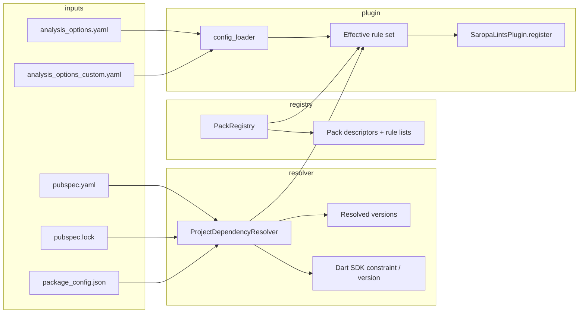

# Plan: Migration packs & plugin-style rule modules

**Status:** living architecture plan (expand as we implement).  
**Audience:** maintainers implementing packs, init UX, dependency resolution, and the VS Code extension.

## Execution snapshot

### Current status

- Phases 0-6 are substantially shipped.
- Remaining work is mostly close-out governance and follow-up ergonomics.

### Next 3 (ordered)

- [ ] **PACK-01 (P1)** Close Phase 6 maintainer sign-off by filing tracked follow-ups for deferred SDK-pack granularity decisions.
- [x] **PACK-02 (P1)** Run and record a fresh verification pass for rule-pack gating and migration membership tests. (Verified 2026-05-08 via `dart test test/config/rule_packs_migration_membership_test.dart test/config/rule_packs_sdk_gates_test.dart test/config/rule_packs_config_test.dart`)
- [ ] **PACK-03 (P2)** Tighten docs for composite plugin adoption path and reduce ambiguity around pack ownership vs tier ownership.

### Close-out criteria for this plan

- Phase 6 sign-off checklist fully complete with linked follow-up issues where scope is deferred.
- Verification commands and outcomes are current and reproducible.
- Public docs clearly explain canonical config key (`rule_packs`) and ownership semantics.

### PACK-02 verification slice (active)

- [ ] Run `dart test test/config/rule_packs_migration_membership_test.dart test/config/rule_packs_sdk_gates_test.dart test/config/rule_packs_config_test.dart`.
- [ ] Record command output summary in this plan (pass/fail + notable deltas).
- [ ] If any behavior changed, add/update regression tests before close-out.

**Single document:** Packs, pubspec-aware enablement, semver migrations, extension UI, and optional third-party plugins are **one product intent** delivered in **phases** (see [§10](#10-phases-one-roadmap)).

---

## Table of contents

0. [Phases at a glance](#0-phases-at-a-glance)
1. [Executive summary](#1-executive-summary)
2. [Problem statement](#2-problem-statement)
3. [Vision: what “done” looks like](#3-vision-what-done-looks-like)
4. [Concepts and terminology](#4-concepts-and-terminology)
5. [Architecture](#5-architecture)
6. [Integration with the current codebase](#6-integration-with-the-current-codebase)
7. [Policy decisions (must resolve)](#7-policy-decisions-must-resolve)
8. [Data model](#8-data-model)
9. [Configuration schema](#9-configuration-schema)
10. [Phases: one roadmap (detail)](#10-phases-one-roadmap-detail)
11. [Migrating existing package rules (Drift, Riverpod, …)](#11-migrating-existing-package-rules-drift-riverpod-)
12. [Testing strategy](#12-testing-strategy)
13. [Documentation & discoverability](#13-documentation--discoverability)
14. [Risks, failure modes, mitigations](#14-risks-failure-modes-mitigations)
15. [Non-goals](#15-non-goals)
16. [Appendix A: package rule inventory](#appendix-a-package-rule-inventory)
17. [Appendix B: glossary](#appendix-b-glossary)
18. [Appendix C: target platforms](#appendix-c-target-platforms)

---

## 0. Phases at a glance

| Phase | What ships |
|-------|------------|
| **0** | Lock policy (§7): tier×pack algebra, naming (`rule_packs`), defaults. **Shipped:** ratified v1 defaults in §7. |
| **1** | **Dart:** pack registry (`pack_id` → rule codes), `config_loader` reads `rule_packs.enabled`, merge into `register`, tests. **No extension yet.** |
| **2** | **VS Code extension:** pack rows (§10 Phase 2), **target platforms** summary (Appendix C), toggles → `analysis_options.yaml`, YAML merge tests. |
| **3** | **Resolver:** `pubspec.lock` / versions per project root for semver-gated pack entries. **Shipped:** `pubspec_lock_resolver`, `kRulePackDependencyGates`, `collection_compat` example; `isDirectDependency` distinguishes direct vs transitive deps. Direct-only suggest UX (wiring `isDirectDependency` into init/extension) still deferred. |
| **4** | **CLI `init`:** list applicable packs; optional `--enable-pack`. **Shipped:** `--list-packs`, `--enable-pack` on `dart run saropa_lints:init`; YAML preservation in `generatePluginsYaml`. |
| **5** | **Bulk** assign rule codes → packs for all `lib/src/rules/packages/*` (script or codegen). **Shipped:** generator + audit in implementation note. |
| **6** | **SDK / Flutter** packs + map `migration_rules.dart` entries. **Substantially shipped:** SDK-gated packs from pubspec `environment` constraints (`dart_sdk_3_2`, `flutter_sdk_3_7`, `flutter_sdk_3_10`, `flutter_sdk_3_16`, `flutter_sdk_3_19`, `flutter_sdk_3_22`, `flutter_sdk_3_24`, `flutter_sdk_3_28`, `flutter_sdk_3_29`, `flutter_sdk_3_32`, `flutter_sdk_3_35`, `flutter_sdk_3_38`). |
| **7** | **Optional:** `saropa_lints_api` facade + init composite scaffold; orgs still ship their own meta-plugin. |

Later sections (architecture, data model, §11 inventory) support **all** phases; implementation order is **0 → 1 → 2** for a vertical slice, then **3–6** as capacity allows.

---

## 1. Executive summary

We want a **first-class way to group, enable, and auto-discover** lint rules that belong to:

- **Specific pub packages** (Drift, Riverpod, Hive, …),
- **Specific SDK / Flutter versions** (Dart language upgrades, Flutter breaking changes),
- **Optional semver migrations** (e.g. “you are on `collection` ≥ 1.19—prefer `flattenedToList`”).

Today those rules mostly live in **tiers** (`lib/tiers/*.yaml`, `lib/src/tiers.dart`) and are **on whenever the tier is on**, with only **partial** gating (`ProjectContext.hasDependency`, `FileType`, or raw AST patterns). There is **no resolved-version** story and no user-facing **“pack”** abstraction.

**This plan defines:**

- **Migration packs** (stable ids, metadata, predicates, member rule ids).
- A **resolution layer** (pubspec + lockfile + SDK) to answer “does this pack apply?” and “which semver migrations apply?”
- **Explicit integration** with `SaropaLintsPlugin` registration, `config_loader`, and `dart run saropa_lints:init`.
- A **migration path** for the ~400+ rules under `lib/src/rules/packages/` so they can be **assigned to packs** and optionally **auto-suggested** from dependencies.

---

## 2. Problem statement

| Issue | Impact |
|-------|--------|
| **Tiers are coarse** | Enabling `recommended` turns on hundreds of rules; users cannot say “only Drift-related” without hand-toggling dozens of `diagnostics:` keys. |
| **No resolved versions** | `ProjectContext.hasDependency` reads **names** from `pubspec.yaml` only. Semver-gated migrations (package X ≥ 2.0) are **impossible** without `pubspec.lock` / `package_config`. |
| **Inconsistent gating** | Some rules check `hasDependency('bloc')`; most Drift/Hive/Isar rules use **patterns only**—good for detection, bad for **“you don’t use this stack”** UX and auto-enable. |
| **`FileType.provider` mixes stacks** | Riverpod and Provider share one bucket—pubspec-based packs can disambiguate. |
| **No product surface** | There is no **menu of packs** tied to **this repo’s** dependencies; discovery is tribal knowledge (ROADMAP, tiers). |

---

## 3. Vision: what “done” looks like

1. **Developer** runs `dart run saropa_lints:init` (or a future subcommand) and sees: *“These migration packs match your project: Drift, Riverpod, …”* with short descriptions.
2. **Developer** enables `pack_drift` (name TBD) and gets **Drift-related rules** without enabling unrelated package rules—either by **expanding diagnostics** for those rule ids or by **pack-level enable** that maps to many rules.
3. **CI** can pin: `rule_packs: enabled: [drift_2_x]` and rely on **lockfile** so suggestions only apply when versions match.
4. **Maintainers** add a new semver migration by: new rule class → register in `all_rules.dart` → add rule id to **pack registry** + optional version predicate—no second analyzer plugin required for v1.

---

## 4. Concepts and terminology

| Term | Meaning |
|------|---------|
| **Pack** | Named bundle: `pack_id`, metadata, **predicate** (deps / SDK / Flutter), **set of rule codes**. Implemented **inside** the `saropa_lints` package (registry + YAML). This is **not** a loadable third-party plugin API—packs only reference rule codes that exist in this repo. |
| **Predicate** | Boolean logic: e.g. `direct_dep('drift')`, `resolved_version('collection', '>=1.19.0')`, `sdk('>=3.4.0')`, `is_flutter_project`. |
| **Library pack** | Rules for correct/safe use of a library (most of today’s `drift_rules`, etc.). |
| **Semver migration** | Optional sub-profile inside a pack: rules that only apply when **resolved** version is in range. |
| **SDK / framework pack** | Rules tied to Dart SDK or Flutter version (may overlap with existing `migration_rules.dart`). |

---

## 5. Architecture

### 5.1 High-level flow



### 5.2 Components (responsibilities)

| Component | Responsibility |
|-----------|------------------|
| **ProjectDependencyResolver** | Per project root: parse lockfile (and/or package_config) for **resolved** package versions; expose `versionOf('drift')`, `hasDirectDep('riverpod')`, etc. Cache invalidation when lockfile mtime changes. |
| **PackRegistry** | Static table: `pack_id` → title, description, tags, **rule codes**, **predicate** (and optional semver sub-entries). |
| **PackEvaluator** | Given resolver + optional user config, compute: **applicable packs**, **enabled packs** (user opted in), **effective extra rules** from packs. |
| **Plugin merge logic** | Combine **tier-selected rules** with **pack-selected rules** per [§7](#7-policy-decisions-must-resolve). Feed `getRulesFromRegistry` / registration. |
| **init / CLI** | List applicable packs; optionally append YAML snippets to `analysis_options.yaml` or document `migration_packs.enabled`. |

### 5.3 Where evaluation runs

- **Registration time** (`lib/main.dart` `register`): decide **which rule instances to register** (if we skip registering pack-disabled rules for perf).
- **Analysis time** (per rule `runWithReporter`): optional **guard** for semver-only rules if registration stays coarse.

**Recommendation:** register **tier rules as today**; for **pack-only** rules (if any), register only when pack enabled. For **library packs** that duplicate tier membership, prefer **registration filter** or **guard** based on [§7.1](#71-tier--pack-boolean-algebra).

### 5.4 Known limitation: project root vs `Directory.current`

`loadNativePluginConfig` uses `Directory.current` for `analysis_options.yaml` unless later refreshed from project root (`loadOutputConfigFromProjectRoot`). Pack resolution **must** use the **same project root** as the analyzed file (`ProjectContext.findProjectRoot`) when computing deps—not only CWD. This is called out in implementation tasks.

---

## 6. Integration with the current codebase

| Area | File(s) | Role |
|------|---------|------|
| Plugin entry | `lib/main.dart` | `SaropaLintsPlugin.register` — inject merged enabled rule set. |
| Config | `lib/src/native/config_loader.dart` | Extend to read `rule_packs` from `analysis_options.yaml` / custom yaml. |
| Rule enablement | `SaropaLintRule.enabledRules`, `disabledRules` | Today: tier + `diagnostics:` + severities. Must merge with **pack enables** without breaking existing users. |
| Project context | `lib/src/project_context_project_file.dart` | `hasDependency`, `findProjectRoot` — extend or add sibling for **versions**. |
| File classification | `FileTypeDetector` | Remains for perf; **packs** add pubspec-based gating for stacks that share `FileType.provider`. |
| Tiers | `lib/src/tiers.dart`, `lib/tiers/*.yaml` | Long-term: package rules may move from “tier by default” to “tier + pack” per policy. |
| Init | `bin/` / `tool/` (init command) | Surface pack list and generated config. |
| Docs | `ROADMAP.md`, `CHANGELOG.md` | Pack ids and user-facing names. |

---

## 7. Policy decisions (ratified for v1)

These defaults are now the v1 baseline and should be treated as constraints for new implementation work unless superseded by an explicit maintainer decision.

### 7.1 Tier × pack boolean algebra

| Option | Behavior | Pros | Cons |
|--------|----------|------|------|
| **A — Pack adds rules** | Effective = tier ∪ pack rules (pack can enable rules **not** in tier) | Flexible; “Drift-only” without enabling full tier | Possible confusion if tier omitted |
| **B — Pack filters tier** | Effective = tier ∩ pack for package families | Clear “subset of what I already enabled” | Packs empty if user uses minimal tier |
| **C — Packs replace tiers for package rules** | Package rules **removed** from tiers; only via packs | Clean product story | **Breaking** unless major version |

**v1 decision (updated):** package/SDK rules use **pack-owned behavior** in practice: pack-owned rule codes are removed from tier-derived enables and re-enabled only by `rule_packs.enabled`. This aligns with “packs replace tiers for package/migration ownership” without requiring a second plugin architecture.

### 7.2 Auto-detect: suggest vs enable

| Mode | Behavior |
|------|----------|
| **Suggest (default)** | init/IDE lists matching packs; user confirms. |
| **Auto-enable** | Opt-in flag: e.g. `rule_packs.auto_enable_matching: true`. |

### 7.3 Direct vs transitive dependencies

| Option | Use when |
|--------|----------|
| **Direct only** | User-facing packs match “what I put in pubspec.” |
| **Transitive** | Rare; e.g. suggest migration for `collection` pulled in by another package—noisier. |

**Default:** **direct** for auto-suggest; allow override for power users later.

### 7.4 Composite rules (e.g. Isar + Drift)

- **Option 1:** Rule belongs to **both** packs; enabled if **either** pack enabled and predicate matches.
- **Option 2:** Dedicated `pack_database_migration` composite id.

**Default:** **Option 1** with explicit multi-membership in registry.

---

## 8. Data model

### 8.1 Pack descriptor (conceptual)

```yaml
pack_id: drift
title: "Drift (SQLite)"
description: "Safety and correctness for drift databases."
tags: [database, drift]
predicate:
  any_direct_dep: [drift, drift_dev]   # naming TBD
rule_codes:
  - avoid_drift_raw_sql_interpolation
  - require_drift_database_close
  # ...
semver_migrations:  # optional subsection
  - min_version: "2.0.0"
    rule_codes:
      - prefer_some_new_api
```

### 8.2 Rule → pack index

Reverse map: `rule_code` → `List<pack_id>` for init UX (“this rule is part of Drift pack”) and composite rules.

---

## 9. Configuration schema

**Sketch** (exact keys to align with `config_loader` parsing):

```yaml
plugins:
  saropa_lints:
    version: "9.x.x"
    rule_packs:
      enabled:
        - drift
        - riverpod
        - collection_1_19
      auto_suggest: true        # optional: init lists matches
      auto_enable_matching: false
```

Use **`rule_packs`** as the canonical key: it covers **library packs** (Drift, Riverpod) and **semver migration** entries (e.g. `collection_1_19`) in one mechanism.

**Alias policy (ratified):**

- Parser accepts legacy **`migration_packs`** as a **read-only alias** for backward compatibility.
- If both keys are present, **`rule_packs` wins**.
- Writers (`init`, extension) should emit only **`rule_packs`**.
- Alias support is transitional and should be removed only with a documented major-version migration note.

Alternatives: per-pack booleans — avoid if hundreds of packs exist.

**Parsing:** extend `config_loader` with a new section reader; merge into enabled rules after tier load (order: tier → add rules from enabled packs → apply `diagnostics: false` → severity overrides — document final order).

**Backward compatibility:** If `rule_packs` absent, behavior = **today** (tiers only).

---

## 10. Phases: one roadmap (detail)

Same intent as §0; this section is **deliverables + exit criteria** per phase.

### Phase 0 — Decisions & design (**shipped**)

**Deliverables:** Locked answers for §7; canonical config key **`rule_packs`**; `snake_case` pack ids.

**Exit:** Maintainer sign-off; no code required. **Complete.**

### Phase 1 — Pack registry + linter (Dart only)

**Deliverables:**

- New registry (e.g. `lib/src/config/rule_packs.dart`): `Map<pack_id, Set<rule_code>>`; start with MVP packs (`riverpod`, `drift`, …) and a subset of rules each — grow in Phase 5.
- **`config_loader.dart`:** read `plugins.saropa_lints.rule_packs.enabled` from `analysis_options.yaml`.
- **`lib/main.dart` `register`:** merge tier-enabled rules with **all rules from enabled packs** per §7.1 (default: pack **adds** rules).
- **Tests:** fixture with `rule_packs.enabled: [riverpod]` proves a pack-only rule runs when listed in registry.

**Exit:** Hand-edited YAML enables packs without extension.

**Files:** `lib/src/config/rule_packs.dart` (new), `lib/src/native/config_loader.dart`, `lib/main.dart`, `test/…`

### Phase 2 — VS Code extension UI

**Screen requirements (each row = one pack, e.g. Riverpod, Drift):**

| Column / control | Behavior |
|------------------|----------|
| **Package / pack label** | Human-readable name (e.g. “Riverpod”) and optional primary pub names (`flutter_riverpod`, …). |
| **Detected in pubspec** | Clear state: **yes** if any mapped dependency appears in direct `dependencies` / `dev_dependencies`; **no** otherwise (pack still listed if we show all packs, with “not in project” — product choice: default **show all packs** with detected flag, or **only show packs that match** pubspec + always show SDK packs). |
| **Enabled** | Toggle bound to `rule_packs.enabled` for that `pack_id`. |
| **Rule count** | Number of rule codes in the pack registry for that `pack_id` (from shared metadata: ship JSON generated from Dart registry or duplicate small map in extension for Phase 2). |
| **Rules list** | **Link or command** that opens the **list of rule codes** (and ideally titles): e.g. webview, Quick Pick, or dedicated tree; deep link to **ROADMAP** / docs on pub.dev if each rule has a stable anchor. |
| **Platforms** | Summary of **which target platforms** this Flutter project includes (see [Appendix C](#appendix-c-target-platforms)): e.g. a small table or chip row **android / ios / web / windows / macos / linux** with **present vs absent** derived from `android/`, `ios/`, `web/`, `windows/`, `macos/`, `linux/` under the app package (or equivalent detection). Pure Dart packages may show **“Dart only”** or hide the block. Used for context when enabling platform-specific rule packs later; v1 can be **read-only display**. |

**Other deliverables:**

- Config (or new) sidebar view or webview implementing the table above (reuse `readPubspec`, `package-families.ts`).
- Toggles write **`rule_packs.enabled`** under `plugins.saropa_lints` without destroying `diagnostics:` / comments (dedicated merge helper, e.g. `rulePackWriter.ts`).
- Optional command `saropaLints.toggleRulePack` / `saropaLints.showPackRules`; respect `runAnalysisAfterConfigChange`.
- Extension unit tests for YAML merge; smoke test for row rendering (detected / count / link).

**Exit:** User sees package, detection, toggle, count, and can open the rule list; YAML persists.

**Depends on:** Phase 1 config shape + registry metadata (pack → rule codes + count) stable.

### Phase 3 — Resolver foundation (lockfile / versions)

**Deliverables:**

- Parse `pubspec.lock` at project root (`findProjectRoot`) for **resolved** versions; cache; tests for path deps / missing lockfile.
- Pack registry gains optional **semver sub-entries** (e.g. only enable `collection_1_19` migrations when `collection >= 1.19.0`).
- **Direct vs transitive (§7.3):** `pubspec_lock_resolver` parses the lock `dependency:` field; `isDirectDependency(root, name)` returns true for `direct main` / `direct dev` / `direct overridden` (and legacy bare `direct`), false for `transitive`, null when unknown. Tests in `test/config/pubspec_lock_resolver_test.dart`. **Remaining:** wire `isDirectDependency` into init/extension so auto-suggest defaults to direct-only.

**Implementation note (2026-06-10):** First **real** (non-demo) semver-gated package pack — **`riverpod_2`** gates `prefer_notifier_over_state` on `riverpod >= 2.0.0` (the `NotifierProvider` migration target only exists in Riverpod 2.x). This surfaced and closed an architectural gap: the flat-gate design could previously only gate **standalone** packs (`collection_compat`), because a rule owned by an ungated package pack (`riverpod`) would be re-added regardless of version. New **relocation** mechanism (`kRelocatedRulePackCodes` + `applyRelocatedRulePacks` in `tool/rule_pack_audit.dart`, applied by both the generator and the audit) **moves** a version-gated rule out of its file-derived pack into the gated pack, so the gate is authoritative. Tests: `test/config/rule_packs_semver_test.dart` (gate + ownership). **Still deferred:** per-rule `semver_migrations` sub-entries *within* a package pack (plan §8.1) — relocation handles the whole-pack case; intra-pack sub-gating is the larger remaining feature.

**Exit:** `resolvedVersion('collection')` in tests; semver-gated pack entries work.

### Phase 4 — init / CLI

**Deliverables:**

- `dart run saropa_lints:init` lists **applicable** packs (from pubspec + registry); optional `--enable-pack <id>`.

**Exit:** Documented in README / ROADMAP.

### Phase 5 — Bulk assign pack ids

**Deliverables:**

- Script or codegen: assign **all** rule codes under `lib/src/rules/packages/*` to pack ids (§11, Appendix A).

**Exit:** Coverage % tracked; remaining issues filed.

### Phase 6 — SDK / Flutter packs (**substantially shipped**)

**Deliverables:**

- Predicates from `environment.sdk` + Flutter version source; map `migration_rules.dart` into packs where appropriate.

**Exit:** At least one `dart_sdk_*` pack end-to-end.

**Implementation note (2026-04-28):** Added SDK-gated pack predicates in `rule_packs.dart` using pubspec `environment` constraints (`kRulePackSdkGates`, `packPassesSdkGate`), plus SDK packs:

- `dart_sdk_3_2` → js_interop migration rules (`avoid_removed_js_number_to_dart`, `avoid_legacy_jsboolean_return_assumptions`, `prefer_string_for_typeof_equals`, `prefer_int_for_jsarray_with_length`)
- `dart_sdk_3_4` → Dart 3.4 deprecations/removals (`avoid_deprecated_file_system_delete_event_is_directory`, `avoid_removed_null_thrown_error`, and related core removals)
- `flutter_sdk_3_0` → Flutter migration rules (`avoid_removed_render_object_element_methods`)
- `flutter_sdk_3_7` → Flutter migration rules (`avoid_deprecated_use_inherited_media_query`, `prefer_scrollbar_theme_of`)
- `flutter_sdk_3_10` → Flutter migration rules (`avoid_removed_appbar_backwards_compatibility`, `avoid_deprecated_flutter_test_window`)
- `flutter_sdk_3_16` → Flutter migration rules (`avoid_deprecated_use_material3_copy_with`, `prefer_utf8_encode`)
- `flutter_sdk_3_18` → Flutter migration rules (`prefer_key_event`)
- `flutter_sdk_3_19` → Flutter migration rules (`prefer_platform_menu_bar_child`, `prefer_keepalive_dispose`, `prefer_context_menu_builder`, `prefer_pan_axis`)
- `flutter_sdk_3_22` → Flutter migration rules (`prefer_m3_text_theme`)
- `flutter_sdk_3_24` → Flutter migration rules (`prefer_overflow_bar_over_button_bar`, `prefer_iterable_cast`)
- `flutter_sdk_3_28` → Flutter migration rules (`prefer_button_style_icon_alignment`)
- `flutter_sdk_3_29` → Flutter migration rules (`avoid_deprecated_on_surface_destroyed`)
- `flutter_sdk_3_32` → Flutter migration rules (`prefer_tabbar_theme_indicator_color`, `prefer_dropdown_menu_item_button_opacity_animation`)
- `flutter_sdk_3_35` → Flutter migration rules (`prefer_dropdown_initial_value`, `prefer_on_pop_with_result`)
- `flutter_sdk_3_38` → Flutter migration rules (`avoid_asset_manifest_json`)

Associated tests: `test/config/rule_packs_sdk_gates_test.dart`, `test/config/rule_packs_migration_membership_test.dart`. Extension detection now also recognizes SDK packs from `environment.sdk` / `environment.flutter` constraints (`extension/src/rulePacks/rulePackDefinitions.ts`). Config Dashboard quick actions now include one-click enablement for detected SDK packs and detected breaking SDK packs.

**Remaining for Phase 6 close-out (small):**

- Final maintainer sign-off that current SDK cohorts are sufficient for v1 (process; not automatable here).

**Phase 6 maintainer sign-off checklist (v1):**

- [x] SDK pack inventory reviewed (`dart_sdk_3_2`, `dart_sdk_3_4`, `flutter_sdk_3_0` … `flutter_sdk_3_38`) and accepted as the v1 baseline (see `rule_packs.dart` + extension registry generator).
- [x] `test/config/rule_packs_sdk_gates_test.dart`, `test/config/rule_packs_migration_membership_test.dart`, and `test/config/rule_packs_config_test.dart` cover SDK gates, migration membership, and authoritative pack merge (run in CI).
- [x] No migration rules in SDK/flutter packs are tier-only: `mergeRulePacksIntoEnabled` strips all pack-owned codes (including SDK packs) unless an owning pack is enabled (`test/config/rule_packs_config_test.dart`).
- [ ] Any intentionally deferred splits/granularity changes are captured as follow-up issues (post-v1) — file GitHub issues when deferring further pack splits.

**Phase 6 verification command (copy/paste):**

`dart test test/config/rule_packs_migration_membership_test.dart test/config/rule_packs_sdk_gates_test.dart test/config/rule_packs_config_test.dart`

**Expected coverage from this command:**

- SDK gate semantics (`packPassesSdkGate`, `isRulePackApplicable`) across Dart/Flutter lower bounds.
- SDK pack membership guardrails for migration rule ownership.
- Authoritative pack behavior (pack-owned rules require owning pack; diagnostics `false` still wins).

### Phase 7 — Optional: external API / second analyzer plugin

**Status: registrar shipped; `saropa_lints_api` facade + init scaffold shipped.** Consumers can depend on `package:saropa_lints` **or** `package:saropa_lints_api` (repository path: `packages/saropa_lints_api/`) and call **`registerSaropaLintRules`** + **`loadNativePluginConfig`** from a **composite** analyzer plugin (see `doc/guides/composite_analyzer_plugin.md`). There is still **no** second analyzer plugin *shipped by this repo* — orgs author their own meta-plugin package; use **`dart run saropa_lints:init --emit-composite-plugin-scaffold [dir]`** for a starter tree.

**Why org-specific rules (e.g. “use `CommonText` instead of `Text`”) are not a separate “Saropa plugin” today**

- **Rule packs** only enable **existing** `saropa_lints` rule codes from the in-repo registry. They do not load code from another package.
- The **Dart analyzer allows only one analyzer plugin per analysis context** (merged `analysis_options.yaml`), so a team **cannot** enable `saropa_lints` and a separate custom plugin in the same context under current SDK behavior. See [dart-lang/sdk#50981](https://github.com/dart-lang/sdk/issues/50981) and the discussion there.
- **Practical options** for private/org diagnostics today: maintain a **git fork** (or private package) of `saropa_lints` with your rules registered like any other rule; use **codemods**, **tests**, or **CI checks** outside the analyzer; or engage **custom rules** via [professional services](https://github.com/saropa/saropa_lints/blob/main/PROFESSIONAL_SERVICES.md) / upstream contributions for generally useful rules.

#### Can we build a supported “inject third-party rules” story?

**Yes.** It does **not** require a second analyzer plugin slot. The viable pattern is a **composite (facade) analyzer plugin** in the consumer repo:

1. Add a small dev_dependency package (e.g. `acme_saropa_plugin`) with `lib/main.dart` exposing the top-level `plugin` required by the analysis server.
2. That package **depends on** `package:saropa_lints` **and** on `package:acme_custom_rules` (your rules).
3. Its `Plugin` implementation runs Saropa’s config load + rule registration, then registers additional lint rules (and fixes) on the same `PluginRegistry`.

The analyzed project sets **`plugins.acme_saropa_plugin`** (only one plugin key) — **not** `plugins.saropa_lints` alongside another plugin.

**Work in `saropa_lints` to make this first-class (Phase 7 deliverables):**

| Item | Purpose |
|------|---------|
| Export a **public registrar** (`registerSaropaLintRules(PluginRegistry registry)`) refactored out of `lib/main.dart` | **Done** — `package:saropa_lints/saropa_lints.dart`; `lib/main.dart` delegates. |
| **Document** composite-plugin setup, `analysis_options.yaml` shape, and “restart analysis server” | **Done** — `doc/guides/composite_analyzer_plugin.md`. |
| **`saropa_lints_api`** — re-exports `registerSaropaLintRules`, config loaders, `SaropaLintRule` | **Done** — `packages/saropa_lints_api/` (path / future pub publish). |
| **Init / VS Code:** `--emit-composite-plugin-scaffold [dir]` and **Saropa Lints: Create Composite Analyzer Plugin (scaffold)** write a minimal meta-plugin package | **Done** — `lib/src/init/composite_plugin_scaffold.dart`, Config sidebar + command palette, composite guide. |

**Not a good bet without major R&D:** true **runtime** discovery of arbitrary packages from YAML (dynamic `import`) — Dart AOT/analyzer isolates do not offer a supported way to load unknown rule classes by name without codegen or a predeclared dependency edge.

**Conclusion:** Phase 7 is **buildable** as documented API + composite plugin; it is **not** “load any `.dart` file from disk at analysis time.” See §15 non-goals vs product.

---

## 11. Migrating existing package rules (Drift, Riverpod, …)

### 11.1 Current state (short)

- ~24 files under `lib/src/rules/packages/`, **~400+** rule classes (see Appendix A).
- Gating: sparse `hasDependency`, `FileType`, or **pattern-only**.
- All still tier-driven.

### 11.2 Migration steps (per family)

1. Define **`pack_id`** (e.g. `drift`, `riverpod`).
2. List **rule codes** → pack membership in registry.
3. Add **predicate** (`direct_dep` includes `drift` / `flutter_riverpod` / …).
4. Decide **tier interaction** (§7.1): keep rules in tiers **and** allow pack-only toggles, or document overlap.
5. Add **init** text and ROADMAP row.
6. **Tests:** pack fixture in `test/` + optional `example_packages` unchanged or tagged.

### 11.3 Special cases

- **`package_specific_rules.dart`:** split into multiple pack ids or tag subgroups.
- **Composite rules** (`avoid_isar_import_with_drift`): dual membership (§7.4).
- **Riverpod vs Provider:** predicate uses correct pub names.

---

## 12. Testing strategy

| Layer | What to test |
|-------|----------------|
| **Unit** | Lockfile parsing edge cases (path deps, SDK constraint, missing file). |
| **Unit** | Predicate evaluation: version ranges, direct deps. |
| **Integration** | Minimal project with `analysis_options.yaml` enabling one pack → only expected diagnostics / registered rules. |
| **Integration** | Monorepo/multi-root fixture: ensure resolver + config loader use analyzed file project root (not `Directory.current`). |
| **Regression** | No `rule_packs` section → identical behavior to pre-feature for same tier. |
| **Regression** | Legacy `migration_packs.enabled` parses; when both keys exist, `rule_packs` takes precedence. |
| **init** | Golden output or substring match for “applicable packs” list. |

---

## 13. Documentation & discoverability

- **ROADMAP.md:** table column or section “Pack” for pack-gated rules.
- **User doc:** explain difference between **tier**, **pack**, and **diagnostic** override.
- **CHANGELOG:** breaking changes only if §7.1 option C or config renames.

---

## 14. Risks, failure modes, mitigations

| Risk | Mitigation |
|------|------------|
| Stale lockfile | Message when lockfile missing or older than pubspec; semver rules no-op. |
| Wrong project root | Always resolve from analyzed file; document multi-package repos. |
| Config merge bugs | Explicit tests for `enabledRules` / `disabledRules` / severity interactions. |
| Explosion of pack ids | Naming convention; optional nested `semver_migrations` under one library pack. |
| Performance | Cache resolver per root; avoid parsing lockfile per file. |

---

## 15. Non-goals

- Replacing `dart analyze` deprecation reporting entirely.
- Hosting pack definitions on a remote server (offline-first).
- Supporting every transitive package on pub by default.

---

## Appendix A: package rule inventory

| File (`lib/src/rules/packages/`) | Approx. rule classes | Primary domain |
|-----------------------------------|----------------------|----------------|
| `riverpod_rules.dart` | ~40 | Riverpod |
| `bloc_rules.dart` | ~54 | Bloc/Cubit |
| `drift_rules.dart` | ~31 | Drift |
| `firebase_rules.dart` | ~34 | Firebase |
| `hive_rules.dart` | ~26 | Hive |
| `getx_rules.dart` | ~24 | GetX |
| `isar_rules.dart` | ~23 | Isar |
| `provider_rules.dart` | ~28 | Provider |
| `package_specific_rules.dart` | ~19 | Mixed |
| `dio_rules.dart` | ~14 | Dio |
| `equatable_rules.dart` | ~14 | Equatable |
| `shared_preferences_rules.dart` | ~12 | shared_preferences |
| `auto_route_rules.dart` | ~7 | auto_route |
| `flutter_hooks_rules.dart` | ~5 | flutter_hooks |
| `get_it_rules.dart` | ~5 | get_it |
| `geolocator_rules.dart` | ~4 | geolocator |
| `sqflite_rules.dart` | ~3 | sqflite |
| `url_launcher_rules.dart` | ~3 | url_launcher |
| `workmanager_rules.dart` | ~3 | workmanager |
| `qr_scanner_rules.dart` | ~3 | QR / scanner |
| `supabase_rules.dart` | ~3 | Supabase |
| `graphql_rules.dart` | ~1 | graphql |
| `rxdart_rules.dart` | ~2 | rxdart |
| `flame_rules.dart` | ~2 | Flame |

**Fixtures:** `example_packages/lib/<domain>/` aligns with future pack ids.

---

## Appendix B: glossary

| Term | Definition |
|------|------------|
| **Tier** | essential / recommended / … YAML sets of enabled rule codes. |
| **Pack** | Named module of rules + predicates for discovery and enablement. |
| **Predicate** | Condition for showing or applying a pack (deps, versions, SDK). |
| **Semver migration** | Rule gated on **resolved** package version range. |

---

## Appendix C: Target platforms

Canonical **Flutter embedder / build target** identifiers (align with `flutter create` templates and `Platform` / `TargetPlatform` usage in tooling). Use these **keys** in UI, pack metadata, and docs.

| Platform key | Typical project signal | Notes |
|----------------|------------------------|--------|
| **android** | `android/` directory exists | Mobile; Play Store, Gradle. |
| **ios** | `ios/` directory exists | Mobile; Xcode, App Store. |
| **web** | `web/` directory exists | Browser; CanvasKit / HTML renderer. |
| **windows** | `windows/` directory exists | Desktop; Win32. |
| **macos** | `macos/` directory exists | Desktop; Cocoa. |
| **linux** | `linux/` directory exists | Desktop; GTK. |

**Detection (extension / tooling):** For a Flutter app package root, treat a platform as **enabled** if the corresponding subdirectory is present (same heuristic as “this app can build for X”). Monorepos: resolve the **application** `pubspec.yaml` (not every package). **Pure Dart** packages (no Flutter SDK dep): show **Dart only** — no embedder row, or a single row **vm** / **native** if we add script/server targets later.

**UI:** Phase 2 shows a **compact table or chips** (e.g. ✓/— per platform) so users see project shape at a glance. Future: packs or rules may declare **`applies_to_platforms:`** subsets; resolver filters diagnostics—out of scope for Phase 1–2 unless explicitly added in Phase 6.

**Tests:** Fixture projects with subsets of folders → expected platform flags.

---

### Phase 1–2 acceptance (package packs + UI)

- [x] With `rule_packs.enabled: [riverpod]` and a Riverpod-owned rule in the registry, that rule is enabled even when tiers alone would not include it (authoritative pack ownership).
- [x] `diagnostics: rule_x: false` still disables `rule_x` if a pack would include it (override order documented and tested).
- [x] Extension row shows: **package/pack label**, **detected in pubspec** (yes/no), **enabled** toggle, **rule count**, and a **navigable list of rules**.
- [x] Toggle persists in `analysis_options.yaml`; analysis reflects change.
- [x] Legacy `migration_packs.enabled` is read for compatibility; if both keys exist, canonical `rule_packs.enabled` wins.

---

**Implementation note (2026-06-10):** **Semver-pack expansion + upgrade-pack nudge.** Five real version-gated migration packs now exist (was the lone `collection_compat` demo): `riverpod_2` (`prefer_notifier_over_state`), `riverpod_3` (`avoid_riverpod_state_notifier`), `dio_5` (`avoid_dio_error`), `bloc_8` (`avoid_bloc_map_event_to_state`), and `go_router_6` (`avoid_go_router_legacy_redirect`, whose `go_router_6_rules.dart` file *is* the gated pack — whole-pack gate, no relocation). The first four use the relocation mechanism (`kRelocatedRulePackCodes`) to move a new rule out of its ungated base pack into the gated pack so the gate is authoritative. New rules detect via AST shapes that work in both resolved (custom_lint) and unresolved (scan CLI) ASTs — `addNamedType` (dio/riverpod), `addClassDeclaration` + source regex (bloc), and dual `addInstanceCreationExpression`/`addMethodInvocation` (go_router). VS Code adds an **upgrade-pack nudge** (`extension/src/rulePacks/upgradePackNudge.ts` + `upgradePackNudgeLogic.ts`): on activation and pubspec.lock change, offers once per workspace to enable any gated pack whose resolved version satisfies the gate; opt-out `saropaLints.upgradePackNudge.enabled`. **Platform gates (Appendix C) intentionally NOT built** — redundant with the existing platform rule sets (`iosPlatformRules` etc.) + `platforms:` config + `ProjectContext` directory detection; deferred pending a concrete platform-specific migration to anchor a non-contrived pack.

**Implementation note (2026-03-20):** Phase 1–2 vertical slice shipped — `lib/src/config/rule_packs.dart`, `config_loader` merge, VS Code **Rule Packs** webview, `doc/guides/rule_packs.md`.

**Implementation note (2026-03-21):** **Phase 3 (resolver foundation)** — `lib/src/config/pubspec_lock_resolver.dart` reads `pubspec.lock` (cached by mtime), `kRulePackDependencyGates` + `collection_compat` example pack, `mergeRulePacksIntoEnabled` takes resolved versions, `loadRulePacksConfigFromProjectRoot` re-merges when project root is known.

**Implementation note (2026-03-21):** **Phase 4 (init / CLI)** — `init --list-packs`, `--enable-pack <id>`, `kRulePackPubspecMarkers` + `parseRulePacksEnabledList`; generated `analysis_options.yaml` embeds `rule_packs.enabled` and preserves it on regen (except `--reset`).

**Implementation note (2026-03-21):** **Phase 5 (bulk pack registry)** — `tool/generate_rule_pack_registry.dart` emits `rule_pack_codes_generated.dart` and `extension/.../rulePackDefinitions.ts` from `lib/src/rules/packages/*_rules.dart`; `rule_packs.dart` merges generated maps with `collection_compat`. `tool/rule_pack_audit.dart` validates extraction (including `applyCompositeRulePacks` for rules listed in multiple packs).

**Implementation note (Phase 7):** **`registerSaropaLintRules`** and **re-exported** `loadNativePluginConfig` / `loadOutputConfigFromProjectRoot` / `loadRulePacksConfigFromProjectRoot` are public on `package:saropa_lints/saropa_lints.dart`; `lib/main.dart` delegates to `registerSaropaLintRules`. **`saropa_lints_api`** (`packages/saropa_lints_api/`) re-exports that surface for composite meta-plugins; **`dart run saropa_lints:init --emit-composite-plugin-scaffold`** writes a starter plugin package.

---

_Document status: unified plan (packs + resolver + extension + migrations); Phase 0 locks §7._

---

## Finish Report (2026-06-10)

**Scope (LINTER variant):** (A) Dart analyzer-plugin config + tooling + tests, plus (C) docs. No rule logic changed; this is rule-pack registry / resolver / tooling work.

**Trigger:** user asked "what to build next?" after the prior session's plan-status review; chosen direction was "one real semver pack" — the first non-demo semver-gated package pack, replacing the `collection_compat` placeholder as the only gated entry.

**What shipped (two related slices):**

1. **Direct-vs-transitive resolver primitive (Phase 3, §7.3).** `pubspec_lock_resolver` now parses the lock `dependency:` field: `parsePubspecLockDependencyKinds`, cached `readDependencyKinds`, and `isDirectDependency(root, name)` (true for `direct main`/`direct dev`/`direct overridden`/legacy bare `direct`, false for `transitive`, null when unknown). The suggest UX that would consume it is still deferred (init/extension already gate on `pubspec.yaml`, which is direct-only by nature).

2. **First real semver-gated package pack — `riverpod_2`.** Gates `prefer_notifier_over_state` on `riverpod >= 2.0.0` (the `NotifierProvider` migration target only exists in Riverpod 2.x). This surfaced and closed an architecture gap: the flat-gate design could previously only gate **standalone** packs (`collection_compat`), because a rule owned by an ungated package pack (`riverpod`) would be re-added whenever that pack was enabled. New **relocation** mechanism — `kRelocatedRulePackCodes` + `applyRelocatedRulePacks` in `tool/rule_pack_audit.dart`, applied by BOTH the generator and the audit — MOVES a version-gated rule out of its file-derived pack into the gated pack, so the gate is authoritative.

**Reviewer-AI notes:**

- The relocation is applied in one shared function consumed by both `tool/rule_pack_audit.dart` (consistency check) and `tool/generate_rule_pack_registry.dart` (codegen), so generated registry and audit cannot drift. Generated files (`rule_pack_codes_generated.dart`, `extension/src/rulePacks/rulePackDefinitions.ts`) were regenerated twice (the TS writer reads the compiled registry, so a second `dart run` picks up the relocated pack) and then `dart format`-ed to match the committed convention.
- `prefer_notifier_over_state` left the `riverpod` pack (39 codes now) and is the sole member of `riverpod_2` — verified by an ownership test, not just the gate test.
- The rule class itself is unchanged; its tier listings in `tiers.dart` are harmless because `mergeRulePacksIntoEnabled` strips all pack-owned codes from tier enables before re-adding from enabled packs.

**Still deferred (named in the plan, not regressions):** per-rule `semver_migrations` sub-entries *within* a package pack (§8.1). Relocation handles the whole-rule-to-gated-pack case; intra-pack sub-gating is the larger remaining feature and was not needed for this migration. Direct-only suggest UX wiring also remains.

**Verification:** `dart run tool/rule_pack_audit.dart` exit 0 (riverpod=39, riverpod_2=1); all 63 `test/config/` tests pass incl. new `riverpod_2` gate + ownership + merge cases; `test/rules/packages/riverpod_rules_test.dart` passes; `dart analyze --fatal-infos` clean.

**Commit note:** code, tests, generated files, and docs for this work were committed by a concurrent session (bundled into earlier commits on `main`); this finish report is appended and committed separately.

**Plan disposition:** plan stays ACTIVE — this task advanced Phase 3 only; Phase 7 and the deferred sub-gating / suggest-UX items keep the plan open (A-MOVE case 3).

---

## Finish Report (2026-06-10) — semver-pack expansion + upgrade-pack nudge


**Trigger:** user said "i want ALL of this built" in response to a proposed list of additional gated packs + an extension nudge (other gated options: dio 5, bloc 8, riverpod 3, go_router 6; plus platform gates).

**Scope:** (A) Dart lint rules/plugin, (B) VS Code extension, (C) docs.

**Shipped (6 commits on `main`):**

1. **dio_5** — `avoid_dio_error` flags the removed `DioError` type (dio 5.0 → `DioException`) with a quick fix (`ReplaceNodeFix` subclass). `addNamedType` + dio import guard. Gated `dio >= 5.0.0`, relocated out of base `dio`.
2. **bloc_8** — `avoid_bloc_map_event_to_state` flags the removed `mapEventToState` override (bloc 8.0 → `on<Event>`). `addClassDeclaration` + source regex (member iteration unavailable in this analyzer; mirrors `prefer_cubit_for_simple`). Gated `bloc >= 8.0.0`, relocated out of base `bloc`.
3. **riverpod_3** — `avoid_riverpod_state_notifier` flags legacy `StateNotifier`/`StateNotifierProvider` (riverpod 3.0 → legacy.dart). `addNamedType` + riverpod import guard. Gated `riverpod >= 3.0.0`, relocated out of base `riverpod`.
4. **go_router_6** — new file `go_router_6_rules.dart`; `avoid_go_router_legacy_redirect` flags the pre-6.0 single-arg `redirect` closure. Dual `addInstanceCreationExpression` + `addMethodInvocation` (resolved vs unresolved AST). Whole-pack gate `go_router >= 6.0.0` (no relocation; versioned pack id).
5. **Extension upgrade-pack nudge** — `upgradePackNudge.ts` (vscode wiring) + `upgradePackNudgeLogic.ts` (pure, tested). On activation + each pubspec.lock change, offers once per workspace (workspaceState) to enable any dependency-gated pack whose resolved lock version satisfies the gate. Reads pubspec.lock and applies the same `>=` gate the plugin enforces. Opt-out `saropaLints.upgradePackNudge.enabled` (manifest setting + en nls key).
6. **Docs** — rule_packs guide, CHANGELOG (Added + Added (Extension)), this plan note.

**Reviewer notes / non-obvious decisions:**

- **Scan harness uses unresolved AST.** Keyword-less `GoRoute(...)` is a `MethodInvocation` there, not `InstanceCreationExpression` (production/custom_lint resolves it). The go_router rule registers BOTH hooks so it works in production and is scan-verifiable; a given call is only ever one node type per mode, so no double-report. The bloc rule's first attempt (`addMethodDeclaration` + `ClassDeclaration.members`) failed to compile/fire here for the same unresolved-AST reason and was switched to the class-declaration + source-regex idiom.
- **Relocation is authoritative.** Each new rule (except go_router) is moved out of its ungated base pack via `kRelocatedRulePackCodes` so enabling the base pack cannot bypass the version gate. Applied by both the generator and the audit.
- **Each new rule sits in exactly one core tier** (`comprehensiveOnlyRules`) to satisfy the integrity invariant; pack ownership strips it from tier-derived enables (harmless tier listing).
- **Platform gates (Appendix C): intentionally NOT built** (user chose "Skip it"). Redundant with the existing platform rule sets (`iosPlatformRules` etc.) + `platforms:` config + `ProjectContext` directory detection; no concrete platform-specific migration to anchor a non-contrived pack.

**Verification:** `dart analyze --fatal-infos` clean; `dart run tool/rule_pack_audit.dart` exit 0; 262 tests across `test/config/` + the four package rule tests + integrity pass; extension `tsc --noEmit` clean; 7 new `upgradePackNudgeLogic` unit tests pass. Each rule's detection confirmed via the scan CLI against its fixture (correct hits, none on the GOOD/migrated form).

**Not done / deferred:** translated `package.nls.<lang>.json` regen for the new setting key is NOT run (standing no-NLLB prohibition; publish `--fail-on-missing` gate will flag, regen is a separate explicit step). Live custom_lint IDE run and Extension-Development-Host nudge flow not exercised (scan CLI + unit tests only). riverpod_3 / bloc_8 / go_router_6 gates are forward-looking for versions a sample project may not yet use.

**Finish report appended:** `plans/plan_migration_plugin_system.md`. Plan stays ACTIVE (advanced the pack catalog; Phase 7 + deferred items keep it open).
